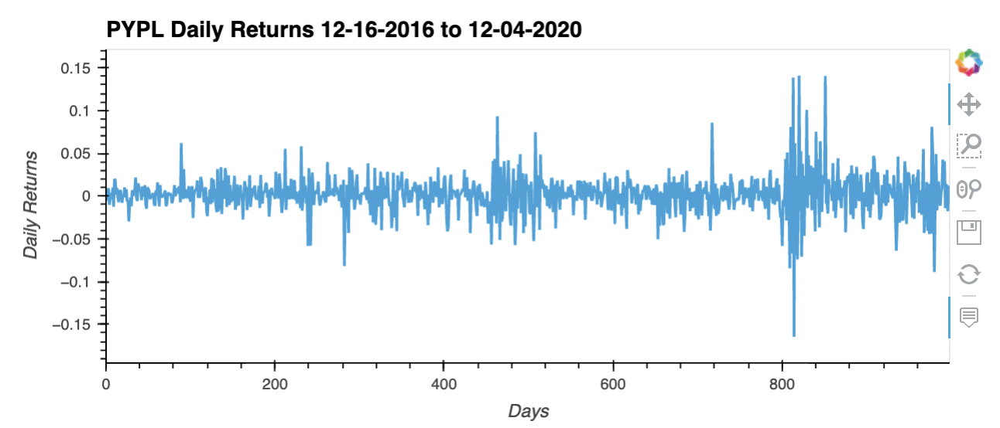
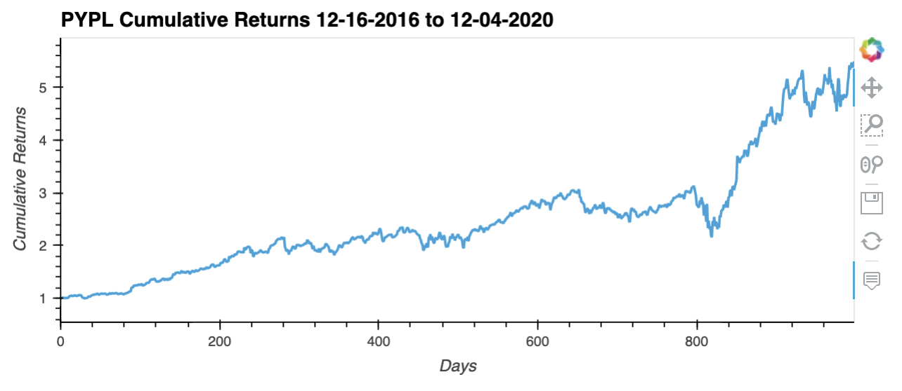
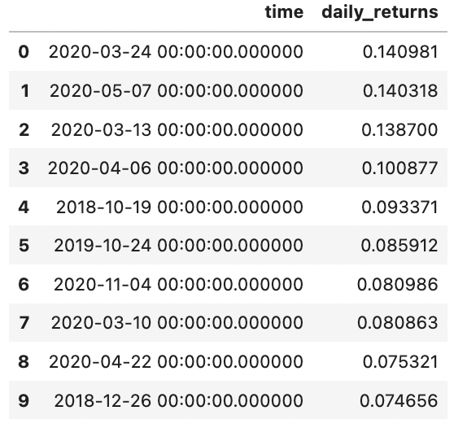
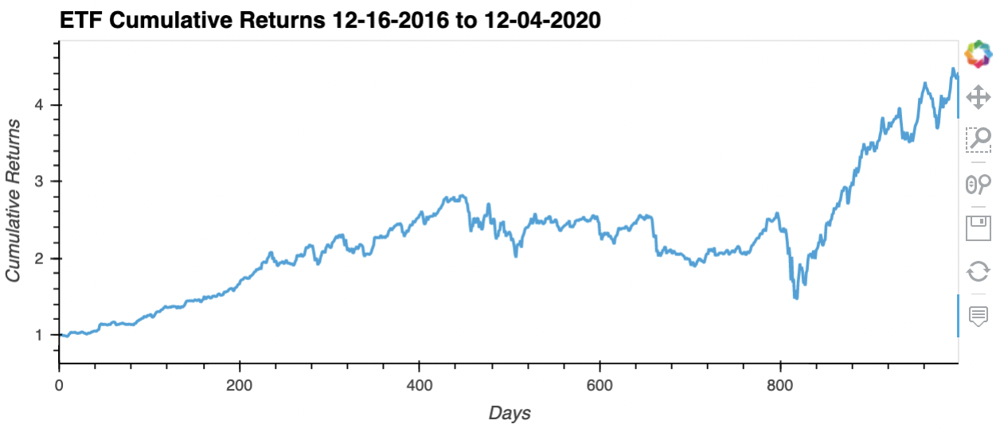
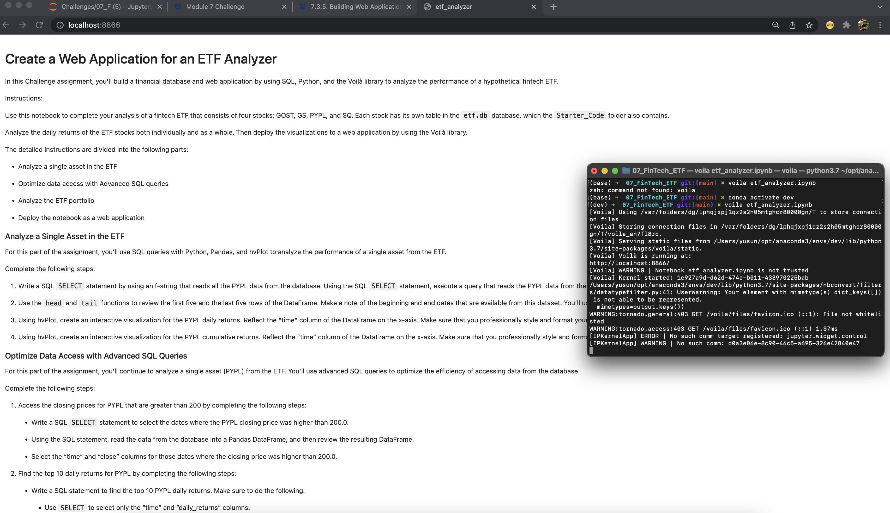
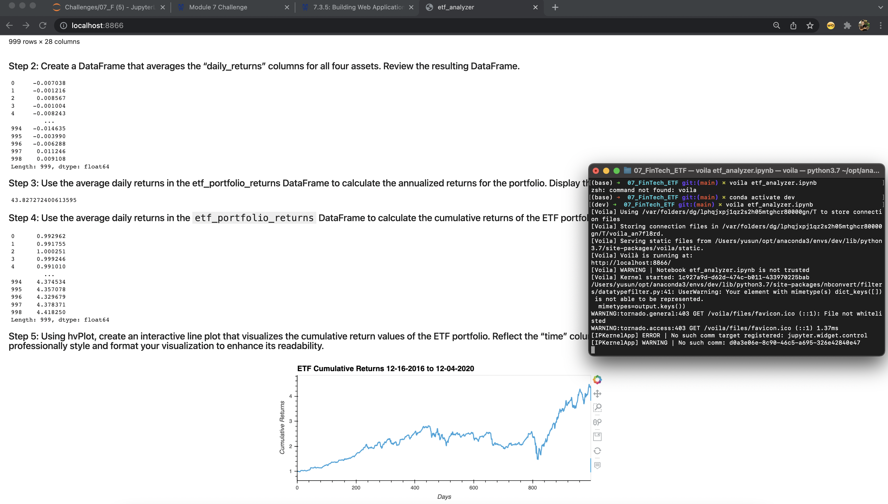

# 07_FinTech-ETF

### This project aims to build a financial database and web application by using SQL, Python, and the Voila library to analyze the performance of a hypothetical fintech ETF.

The stocks in the provided `etf.db` database are GDOT, GS, PYPL, and SQ, where each has its own table in this database.

---

## Technologies

This project leverages python 3.9 and Jupyter lab notebook was used to run all analysis. To deploy this Jupyter notebook to a fully interactive web application, the [Voila](https://voila.readthedocs.io/en/stable/using.html) library was used.

---

## Installations

Before running the application first import the following libraries and dependencies.

```python
import numpy as np
import pandas as pd
import hvplot.pandas
import sqlalchemy
```

---

## Analysis of a Single Asset in the ETF

After the imports and before any analysis, using the setup below to create a temporary SQLite database and populate the database with content from the provided `etf.db` seed file:

```python
database_connection_string = 'sqlite:///etf.db'

# Create an engine to interact with the SQLite database
engine = sqlalchemy.create_engine(database_connection_string, echo=True)

# Confirm that table names contained in the SQLite database.
inspector = sqlalchemy.inspect(engine)
inspector.get_table_names()
```

Once confirmed, select all data and use the query to read the PYPL data into a Pandas DataFrame. Then proceed to plot the `daily_returns` values and the calculated cumulatie returns using hvPlot:

PYPL Daily Returns



PYPL Cumulative Returns



---

## Optimized Data Access with Advanced SQL Queries

In this section, we proceeded to use advanced SQL queries to optimize the efficiency of accessing data from the database.

For instance, writing SQL SELECT statements to find PYPL's top 10 daily returns sorted from highest to lowest is very useful in analyzing the stock:



---

## ETF Portfolio Analysis

Now, we use a SQL query again to join each stock's table in a single ETF dataframe and plotted the portfolio's cumulative returns (calculated via the `daily_returns`) using hvPlot:



---

## Deploying the Jupyter Notebook as a Web Application

To deploy this into a web application, run the Voila web app tool in the terminal using the following:

```python
voila <relative-path-to-notebook>
```

Below are what the web applications and terminal codes look like:




